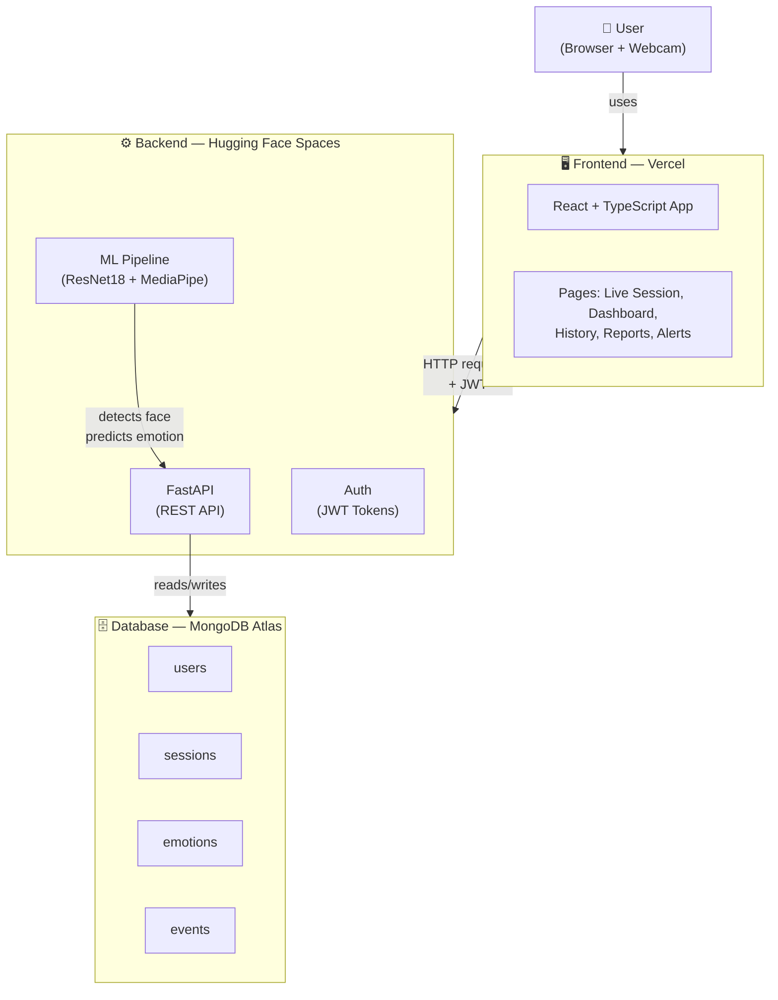
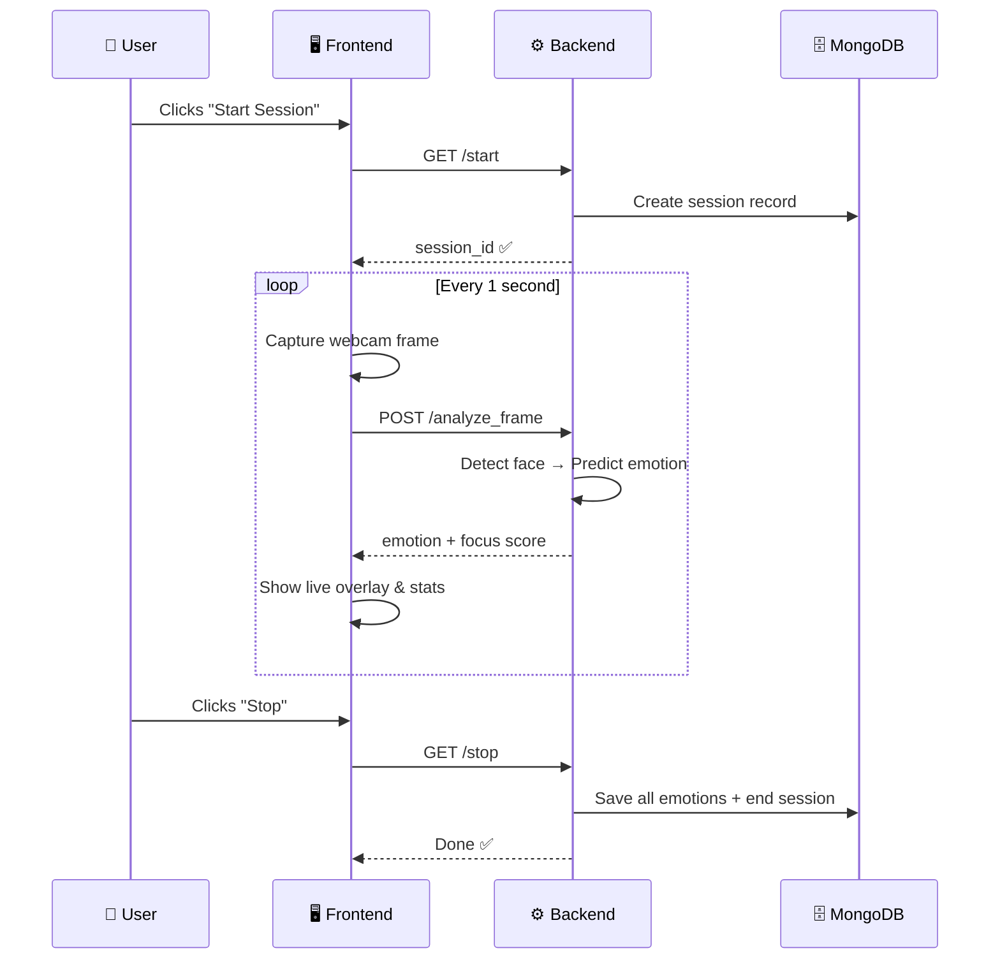

# MindTrace — Simplified Architecture

## System Layers

---

## Live Session Flow (Step by Step)

---

## What Each Part Does

| Part | Role |
|------|------|
| 🖥️ **Frontend** (Vercel) | UI, webcam capture, shows charts & live stats |
| ⚙️ **Backend** (HF Spaces) | API server, processes frames, handles login |
| 🤖 **ML Pipeline** | Detects face → predicts emotion → calculates focus score |
| 🗄️ **MongoDB Atlas** | Stores users, sessions, emotion data |
